# ML pipeline — data, training, tracking, evaluation

The companion to [`system block diagram.md`](system%20block%20diagram.md). That
file draws the **deployed** system: 100 cameras, DeepStream edge nodes, camera
coordination, alerts. This file draws the **research** system that produces the
model the deployed one consumes: where the data comes from, how a detector is
trained, how trackers are scored, and what is exported at the end.

Read them as two halves of one thing:

| | diagram | question it answers |
| --- | --- | --- |
| research | this file | how did we get the weights, and can we trust them? |
| deployment | `system block diagram.md` | what runs on site with those weights? |

Everything below is Mermaid source. It renders in GitHub, VS Code and
`docs/diagrams/`. To produce SVG/PNG the same way the other diagram's exports
were made:

```powershell
npx -y @mermaid-js/mermaid-cli -i "docs\diagrams\ml pipeline diagram.md" `
     -o "docs\diagrams\ml-pipeline.svg" -b transparent
```

---

## 1. The spine

One command per stage, one direction, no implicit work.

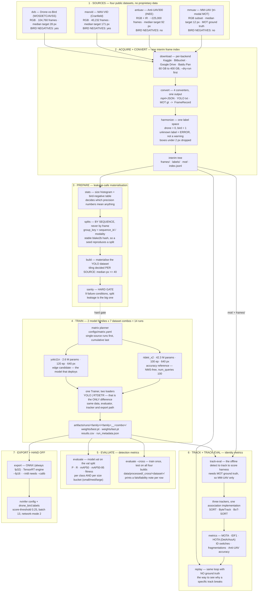

---

## 2. Stage by stage

### 2.1 Convert — four genuinely different formats, one output

| source | native format | converter | notes |
| --- | --- | --- | --- |
| `dvb` | `<frame> <n> x y w h …` per-video, **or** flat Kaggle `images/` + `labels_drones/` | `DvbConverter` / `DvbFlatConverter` | layout-sensitive dispatch (`data/convert/__init__.py:32`). Aborts if birds outnumber drones by >1.5× — that means the class mapping is inverted |
| `mavvid` | already YOLO txt, pre-split | `MavVidConverter` | sequence recovered by layout token → filename id → pHash clustering at Hamming ≤ 4 |
| `mmuav` | `gt_rgb/gt.txt`, MOT 9-column | `MmUavConverter` | writes `mot/` verbatim, and is the only source with **multi-object identity** — which is why identity metrics are measured here |
| `antiuav` | `<seq>.json`, three accepted shapes | `AntiUavConverter` | emits **two independent** records per sequence (`rgb` and `ir`), never fused, and writes `mot/` with the publisher's `v` visibility flags (single-target, so id is always 1) |
| `mmuav` | `gt_rgb/gt.txt`, MOT 9-column | `MmUavConverter` | writes `mot/` verbatim, and is the only source with **multi-object identity** — which is why identity metrics are measured here |

All four emit the same `FrameRecord` (`data/frameindex.py:42`), and everything
downstream reads only that.

```
data/interim/<dataset>/<variant>/
    frames/<sequence_id>/<modality>/<stem>.jpg
    labels/<sequence_id>/<modality>/<stem>.txt   # YOLO: cls cx cy w h, normalised
    mot/<sequence_id>/<modality>.txt             # MOT gt, when the source has it
    index.jsonl
    convert_report.json
```

`index.jsonl` is the spine of the whole project. `replay`, `track-eval`,
`dedup`, `build` and `ReID` training all read it instead of touching images.

### 2.2 Splits — the one invariant that decides whether your mAP means anything

All four datasets are video-derived. Adjacent frames of a hovering drone are
near-identical, so a frame-level split leaks and inflates mAP by double digits.

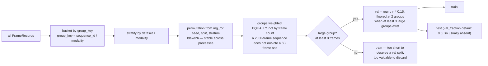

Written: `index.jsonl` gains a `split` field, plus `splits.json`,
`train.txt`, `val.txt` at the combo root. `splits.json` stores the full
`{group_key: split}` table, which is what makes a val number reproducible months
later.

**Why a stable hash and not `hash()`** — Python salts string hashing per process,
so `hash()` gave every run a different split. That makes the seed a lie and the
experiment matrix irreproducible. `utils/seed.py:45` uses blake2b; there is a
regression test that spawns a subprocess to prove the property.

### 2.3 Build + tiling — decided per source, and the combo may override

Tiling is the reason MM-UAV is trainable at all, and the reason MAV-VID is not
ruined by it.

| source | median target | tiled? | tile | why |
| --- | --- | --- | --- | --- |
| `mmuav` | **12 px** | yes, by `tiling_override` | 256 px, overlap 0.30, min_vis 0.40 | RGB frames are 640×360, so a 640 tile would crop the whole frame and magnify nothing. 256 → 640 is 2.5×, turning 12×5 px into ~30×12 px |
| `dvb` | **28 px** | yes (≤ 40 px threshold) | 640 px | 28 px sits right at the letterbox limit |
| `antiuav` | 92 px | no | — | comfortably detectable |
| `mavvid` | 171 px | no | — | tiling it would cost 4–6× for nothing |

`resolve_tiling` resolves one source inside one combo, in this order:

1. the dataset's own `tiling_override` — MM-UAV's 256 px window, and it outranks
   everything below, because it is the dataset's own decision about its own frames;
2. the combo's `force_tiling` — `true`/`false` on the four single-source combos,
   `null` (defer) on the cumulative ones;
3. the median-size rule, `median_target_px <= 40`.

So "tiling is decided per source, not per combo" is the *intent* — `dvb+mavvid`
tiles `dvb` and leaves `mavvid` alone — while a combo still holds the final say
for sources that do not declare an override. `data/capabilities.py` follows that
same precedence, so the capability tables cannot claim a source is untiled while
`build` tiles it; `tests/test_capabilities.py` asserts it for all seven combos.

Two further decisions worth knowing:

- **Target boxes are dropped, not clipped, below `min_visibility`.** A 3 px
  fragment of a bird wing is a false-positive factory
  (`utils/imaging.py:256`).
- **Tiles containing no drone are still emitted, as negatives.** At 25 % overlap
  a frame becomes 4–6 windows and most are sky and clutter — which is exactly the
  material that teaches the detector not to fire. Dropping them would bias
  training towards positives and leave `rules.confidence.initiate` uncalibratable.

`MAX_AREA_EXPANSION = 12` is the ceiling; exceed it and the source gets a warning
rather than a 20× disk surprise.

### 2.4 Sanity — nine ways to fail before a GPU hour is wasted

`anti-uav sanity` exits non-zero, and `run_pipeline.ps1` treats it as a hard gate
that ignores `-StopOnFailure`.

| check | failure condition |
| --- | --- |
| `index` | zero records |
| `sequence_count` | fewer than 10 sequence groups |
| `splits_assigned` | any record with an empty `split` |
| `val_split` | no val groups at all |
| `split_leakage` | **a `group_key` in more than one split** |
| `expected_sources` | a combo declares a dataset the index does not contain |
| `class_index_range` | a `class_id` outside `[0, n_classes)` |
| `label_files` | an indexed frame with no `.txt` on disk |
| `label_geometry` | a label centre outside `[0,1]` |

Plus warnings worth reading: too few val sequences, no birds anywhere, too few
negative frames, median target below 8 px.

Note that two checks **read the label files back off disk** rather than trusting
`index.jsonl`, because the index does not store box geometry. That turns them
into an independent check that the labels contain what the index claims.

---

### 2.5 What each source is allowed to prove

Four public datasets do not support the same conclusions, and the differences are
not cosmetic. They are the reason `docs/EXPERIMENTS.md` says to read the
per-dataset table instead of a combined number.

| source | birds? | median | tiled | MOT GT | identity | visibility |
| --- | --- | --- | --- | --- | --- | --- |
| `dvb` | **yes** | 28 px | 640 | no | no | no |
| `mavvid` | **yes** | 171 px | — | no | no | no |
| `antiuav` | no | 92 px | — | yes | no (1 target) | **yes** |
| `mmuav` | no | 12 px | 256 | yes | **yes** | no |

Two derivations that are easy to get wrong, and both are pinned by tests:

- **Only `dvb` and `mavvid` carry birds** — not just `dvb`. They are the only two
  sources that can turn a precision number into evidence about false positives. A
  detector that labelled every bird as a drone scores perfectly on `antiuav` or
  `mmuav`, because neither has a bird to misclassify.
- **"Has track ids" is not "has identity".** `antiuav` emits MOT ground truth but
  is **single-target**: every box is id 1. `has_track_ids: true` satisfies a naive
  check while making IDF1 and ID-switch counts vacuous, because every identity
  trivially matches every other. So `has_multi_object_identity` is a separate
  registry fact, and **only `mmuav` carries it**.

#### The pipeline does not fork; the claims do

This is the important part, and the reason the project is one pipeline rather than
four. `build.py` merges N sources into one YOLO dataset (`for alias in
combo.datasets`), so the cumulative combos and the production model (`all4`) are
possible at all. Splitting into per-dataset pipelines would delete 3 of the 7 runs
— including the one you would deploy — and would make the "do the sources
interfere?" question unanswerable.

What is explicit instead is **what each combo's numbers are allowed to claim**. A
combo inherits the union of its sources' capabilities:

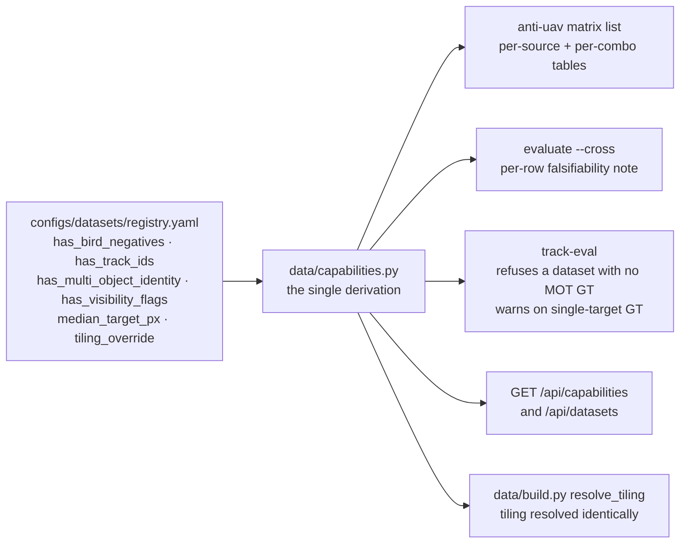

Before `data/capabilities.py` existed, these facts were honoured in four separate
places — a `data.yaml` provenance note, a note string on each `--cross` row, a
warning in `track-eval`, and a `median_target_px` comparison in `build`. That
worked, but it had the shape of an accident waiting to happen: adding a fifth
dataset means remembering four places, and forgetting one is a silent hole rather
than a failure.

What it gates:

| surface | behaviour |
| --- | --- |
| `anti-uav matrix list` | per-source and per-combo capability tables, plus every claim a combo cannot support |
| `anti-uav evaluate --cross` | each row's falsifiability note now reads off the contract |
| `anti-uav track-eval` | **refuses** a dataset with no MOT GT; **warns** on single-target GT that IDF1/IDSW are meaningless |
| `GET /api/capabilities` | the whole contract as JSON, so the console cannot disagree with the CLI |
| `resolve_tiling` | tiling is resolved through the same precedence, so a table cannot claim a source is untiled while `build` tiles it |

```
$ anti-uav matrix list          # abridged

combo                birds      identity  trackGT         tiled
dvb                  dvb        -         -               dvb
mavvid               mavvid     -         -               -
antiuav              -          -         antiuav         -
mmuav                -          mmuav     mmuav           mmuav
dvb+mavvid           dvb,mavvid -         -               dvb
dvb+mavvid+antiuav   dvb,mavvid -         antiuav         dvb
all4                 dvb,mavvid mmuav     antiuav,mmuav   dvb,mmuav

  ! antiuav: no bird negatives, so precision is not evidence about false
      positives (use dvb, mavvid)
  ! antiuav: single-target ground truth, so IDF1 and ID switches are
      meaningless
```

Note `all4`: it *can* falsify false positives, because `dvb` and `mavvid` are in
it. That says nothing about how either behaved alone — which is exactly why the
per-dataset table is still the thing to read.

---

## 3. The models

Two families, one pipeline. The only genuine code difference between them is
which ultralytics loader is constructed — `YOLO` or `RTDETR`
(`detection/trainer.py:56`). Same data, same splits, same evaluator, same tracker
stack, same export path.

| | `yolo11n` | `rtdetr_x2` |
| --- | --- | --- |
| role | **edge candidate** — the model that deploys | **accuracy reference** — a measuring stick |
| params | 2.6 M | 42.3 M |
| base weights | `yolo11n.pt` (COCO) | `rtdetr-x2.pt` (COCO) |
| epochs / patience | 120 / 50 | 100 / 40 |
| optimiser | `auto` (ultralytics picks) | `AdamW` |
| base LR `lr0` | 0.01 | **0.0002** |
| warmup | 3.0 ep | **1.0 ep** |
| mosaic | 1.0, `close_mosaic: 15` | **0.0** |
| `scale` aug | 0.5 | 0.4 |
| `cls` loss weight | 0.5 | 2.0 (focal variant) |
| `num_queries` | — | 100 |
| NMS | `true` | `false` — NMS-free by construction |
| batch | `-1` (auto) | `-1` (auto; halved first if you OOM) |
| early-stop metric | `map50-95` | `map50-95` |

**Why RT-DETR is NMS-free and still feeds the same tracker** — its decoder emits
a fixed, already-deduplicated set of queries, and the boxes arrive through the
same `.boxes` attribute as YOLO's. That single fact is what makes one tracker
stack legitimate for both families.

**Why mosaic off for RT-DETR** — the hybrid encoder and denoising queries were
designed for clean single-scale training; ultralytics' own fine-tuning recipe
keeps mosaic at 0. Leaving it on costs accuracy *and* memory.

**Why `map50-95` and not `mAP50`** — at a 12–28 px target, `mAP50` is very
generous: a detector that puts a loose box on the right patch scores well.

**`metric:` is the headline, not the early-stopping rule.** Ultralytics always
early-stops on its internal `fitness` blend and exposes no hook to change that, so
`patience` is what bounds a run. `metric:` records which number this run is
*judged* on: it is resolved against the `results.csv` column and written to
`run_metadata.json` as `primary_metric` / `primary_metric_value`.

### 3.1 The experiment matrix — 14 runs

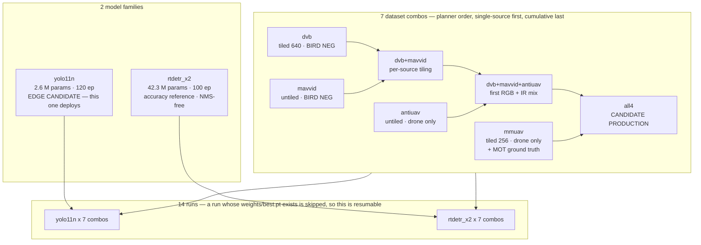

| combo | what it answers |
| --- | --- |
| `dvb` | does bird suppression work at all? **the only combo that can falsify a false-positive claim** |
| `mavvid` | does it transfer to a different capture domain? |
| `antiuav` | does it track through occlusion, on a second modality? |
| `mmuav` | does it detect 12 px targets once tiled? |
| `dvb+mavvid` | is more bird data better? |
| `dvb+mavvid+antiuav` | bird suppression plus occlusion? |
| `all4` | is the combination worth deploying? |

Run order matters: the planner puts single-source runs first so a failure shows
up on the cheapest dataset rather than on the cumulative one.

```powershell
anti-uav matrix list                                    # all 14, resolved settings, cost estimate
anti-uav matrix run --models yolo11n --combos all --dry-run
.\scripts\train_matrix.ps1 -Profile blackwell            # resumable
```

### 3.2 Config resolution — what actually reaches ultralytics

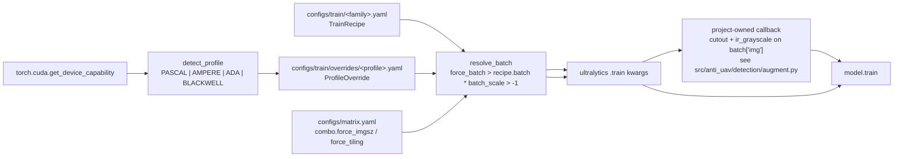

Two augmentations in the recipe are **not** ultralytics knobs and are applied by
this project's own callback on `on_train_batch_start`:

| knob | value | why it is not built in |
| --- | --- | --- |
| `cutout` | 6 (YOLO) / 3 (RT-DETR) | ultralytics removed `cutout` from `RandomPerspective` |
| `ir_grayscale_probability` | 0.15 | no equivalent; albumentations is an optional extra this project does not depend on |

Both operate on the already-normalised batch tensor, filling with zeros (the
dataset mean, so a patch reads as uninformative rather than as a black rectangle)
and collapsing a random fraction of the batch to Rec. 601 luma. They run for both
model families, so they do not fork the two code paths. A dedicated
`torch.Generator` seeded from the run seed drives them, which means enabling
cutout does **not** shift every other random decision in the run — the promise
`seed:` makes still holds.

`batch_scale` scales a batch the **recipe** pins. Both shipped recipes use `-1`
(auto), which ultralytics resolves from free VRAM after reading the card and
which therefore cannot be scaled from outside — so `force_batch` is what actually
governs a constrained profile, and setting `batch_scale` against an auto batch
logs a warning rather than pretending to apply.

### 3.3 The preflight gate

`_preflight` (`detection/trainer.py`) is the part that earns its keep:

- CUDA 12.8 removed `sm_61`, so a default `pip install torch` **cannot run on a
  GTX 1070 at all**. If the GPU's arch is not in `torch.cuda.get_arch_list()`,
  it warns here instead of dying at epoch 1.
- Pascal/Volta has no FP16 arithmetic path, so `force_amp: false` is applied and
  the conflict is re-warned.
- RT-DETR on CPU is refused as not worth running.

`verify-env` does the same checks as a hard startup gate, and
`fetch-weights` moves ultralytics' mid-trainer checkpoint download to a step
that costs five seconds instead of a full dataset build.

---

## 4. Inside the tracker

The project owns its trackers. ultralytics 8.4 ships **no** `track` task —
`model.predict(..., persist=True)` raises `SyntaxError: 'persist' is not a valid
YOLO argument`. So video inference calls `predict_image` per frame and feeds this
project's own association code. The second benefit is larger than the first: the
live path and the `track-eval` harness share **one** implementation, so a number
from the harness describes what the pipeline does.

### 4.1 Per-frame loop

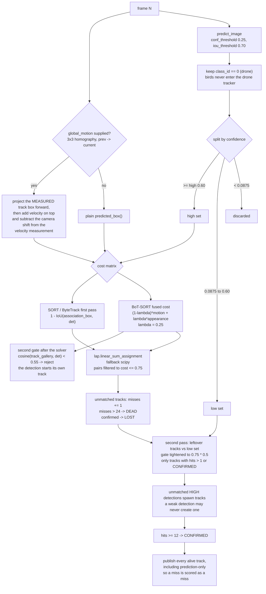

Four details that are easy to miss:

- **No Kalman filter in the local trackers.** Prediction is on-demand:
  `Track.predicted_box(damping=1.0)` is the last measured box shifted by
  velocity derived from consecutive *measured* centres. Predictions are never
  written back onto the observation. The metric-space Kalman filter
  (`tracking/kalman.py`) is for **cross-camera** fusion only.
- **Prediction-only tracks are published.** Suppressing them would make a
  fragmented track look clean.
- **The low-confidence second pass really runs.** `_second_pass` receives the
  already-split low list from `update`; it does not re-derive it from the high
  list. Re-splitting a list that is already entirely above `high_threshold`
  yields an empty result, which is how this pass was silently dead for a while.
- **Camera motion is compensated in two places, not one.** Projecting the
  predicted box forward is not enough on its own: a 200 px pan between frames is
  also measured as 200 px/frame of *target* velocity, which then throws the
  prediction off on the following frame. So the measured box is projected first,
  the velocity is added on top, and the camera's own displacement is subtracted
  from the velocity measurement. With that, one target crossing a 200 px pan is
  **one** identity instead of two — see `TestCameraMotionCompensation`.

### 4.2 Tracker comparison

| | SORT | ByteTrack | BoT-SORT |
| --- | --- | --- | --- |
| cost | `1 - IoU(assoc box, det)` | same | `(1-0.25)*motion + 0.25*appearance_cost` |
| low-confidence 2nd pass | — | yes, gate × `low_match_scale` 0.5 | inherits ByteTrack's |
| may create a track | any | only high-confidence | only high-confidence |
| appearance gate | — | — | post-solver cosine ≥ 0.55 |
| gallery | — | — | last 16 embeddings, max similarity |
| camera-motion compensation | via `global_motion` | via `global_motion` | via `global_motion` |
| reference | SORT | Zhang et al., ECCV 2022 | Cao et al., arXiv 2206.14651 |

`global_motion` is accepted by all three trackers' `update()`. Passing `None`
(the default) is exactly the previous behaviour; passing a 3×3 homography maps
*previous* image coordinates to *current* ones, and is what the edge supplies from
a PTZ's commanded delta.

Threshold derivation for `track-eval` and `replay` — all read from
`configs/rules/drone_rules.yaml`, never hardcoded in the harness:

```
high_threshold   = rules.confidence.initiate                    = 0.60
low_threshold    = rules.confidence.maintain / 4                = 0.0875
match_threshold  = rules.tracking.max_association_cost           = 0.75
max_age          = rules.tracking.max_target_age_frames * 6      = 24
min_hits         = rules.persistence.min_hits                    = 12
```

### 4.3 The ReID / appearance ladder

Deliberately cheap — it runs per detection inside a pipeline already
batch-inferring 13 streams. Three tiers, tried in order:

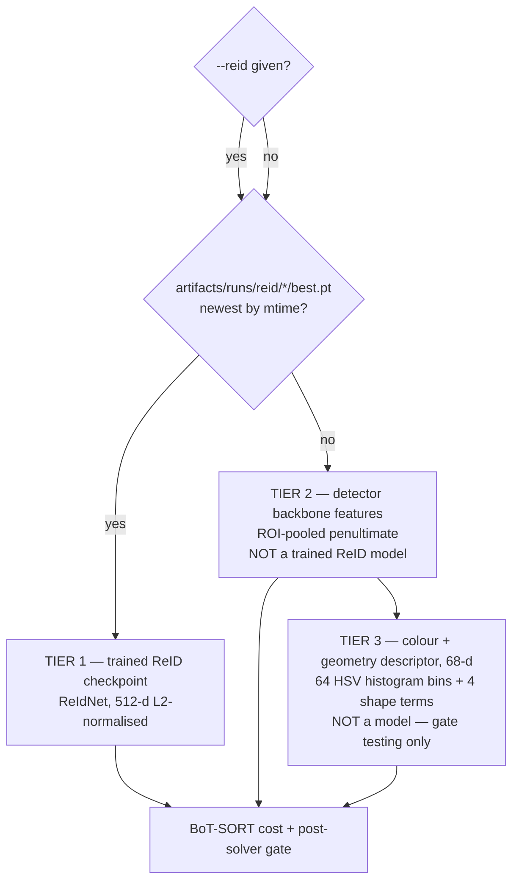

Tier 1 is what `train_reid` produces, and it writes to
`artifacts/runs/reid/<dataset>_<variant>_<arch>/best.pt` — one directory per run.
The implicit lookup takes the newest of those. `anti-uav track-eval --reid <path>`
and `anti-uav replay --reid <path>` override it, which is how you compare two
checkpoints; `--no-reid` / `--no-embeddings` ablate the gate entirely for the
A/B row. A checkpoint whose declared `arch` is not one this project can build is
reported rather than quietly replaced by the colour descriptor.

Crop geometry: 64 px input, 20 % context margin to keep the rotor span, clamped
to the image (never padded). A 15 px target upsampled to 256 would waste the
whole input on interpolation.

Training is a scriptable API (`reid_train.train_reid`) with **no CLI
subcommand** — it needs a multi-identity dataset, so it hard-errors on fewer
than 2 classes and tells you to use MM-UAV.

| | |
| --- | --- |
| architectures | `color` (default), `resnet18`, `mobilenet_v3_small`, `tiny_cnn` |
| embedding | 512-d, projected → BatchNorm1d → L2-normalised |
| loss | cross-entropy, `label_smoothing 0.1` — the classification head exists **only to train the features** |
| optimiser | AdamW, lr 1e-3, weight decay 5e-4, cosine schedule, 30 epochs, batch 64 |
| identity label | MOT `track_id` where the dataset has them, else `sequence_id` |
| split | by sequence, val fraction 0.15 — never by frame |
| filters | crops under 12 px dropped, 400 crops per sequence cap |
| output | `artifacts/runs/reid/<dataset>_<variant>_<arch>/best.pt` + `reid_report.json` |

`reid_report.json` states explicitly that its top-1 accuracy is **not** the
tracking metric — the number that matters is HOTA/IDF1 from `track-eval`.

Note that `predict_stream` does not attach embeddings: appearance is on in the
offline harness and off in the live video path.

---

## 5. Evaluation

Detection metrics and tracking metrics are **separate experiments**. A detector
can be excellent and the tracker still fragmenting.

### 5.1 Detection evaluation

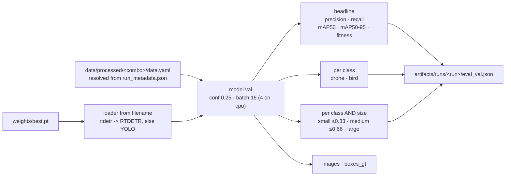

`--cross` is the part that matters, and it does something specific: for each of
the four datasets it synthesises a **one-source** dataset out of that dataset's
own val frames (`data/processed/_cross/<alias>/`, images hard-linked, not
copied), then runs `val` on it. One training run, four test sets.

```
dataset   map50   map50-95    prec   recall   drone AP_S   bird AP   falsifiable?
dvb       ...     ...         ...    ...      ...          yes       YES
mavvid    ...     ...         ...    ...      ...          yes       YES
antiuav   ...     ...         ...    ...      ...          no        NO
mmuav     ...     ...         ...    ...      ...          no        NO
```

Three of the four datasets contain **no bird annotations**. Precision measured on
them is unfalsifiable — a detector that labels every bird as a drone scores
perfectly. The evaluator prints that next to the number rather than leaving you
to remember. Judge false positives only on `dvb` and `mavvid`.

Size buckets use normalised `sqrt(area)` at 0.33 / 0.66, matching
`utils/geometry.py`. `drone AP_S` is the column that says whether tiling worked.

### 5.2 Tracking evaluation

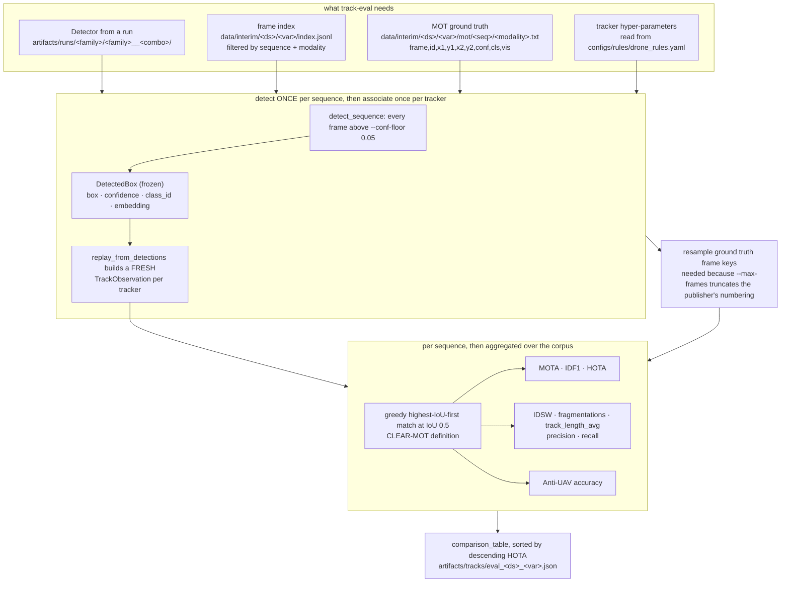

**Detection runs once per sequence, not once per tracker.** Detections are
captured as frozen `DetectedBox` rows and each tracker gets its own freshly built
`TrackObservation` from them. That is roughly a 3× saving on the default
three-tracker sweep, and it is also strictly more correct: any difference between
the tracker rows is then attributable to the tracker rather than to detector
nondeterminism. `TestReplayDetectionCache` asserts both halves — one inference
pass, and cached scores identical to the uncached path.

**The metric definitions, exactly as implemented:**

| metric | definition |
| --- | --- |
| `MOTA` | `1 - (misses + false_positives + id_switches) / gt_boxes` |
| `MOTA` (corpus) | computed from **summed** counts, not averaged per sequence — MM-UAV sequences vary 10× in length |
| `IDF1` | `2*idtp / (2*idtp + idfp + idfn)` with `idtp = matched`, `idfn = gt - matched`, `idfp = pred - matched` |
| `HOTA` | per α in `{0.50, 0.55, … 0.95}`: `DetA(α) = TP/(TP+FN+FP)`, `AssA(α) = TP/(TP+FN+IDSW)`, `HOTA(α) = sqrt(DetA·AssA)`; reported as the mean over α, with `det_a` and `ass_a` also reported |
| `IDSW` | a GT id matched to pred P on frame *t-1* and to a different pred Q on frame *t* |
| `fragmentations` | an unmatched GT id that had a previous match |
| `track_length_avg` | mean frames a predicted identity spent matched to something. Low values alongside a high `matched` count mean one target is being shredded into many short identities |
| `Anti-UAV accuracy` | per frame: `max IoU` against **visible** GT when the target is present; **1.0** for correctly abstaining when it is absent; **0.0** for hallucinating a box when absent or for missing a present target. The average spans **every** frame in the union of GT and prediction frame keys, absent ones included — so a tracker that fires on empty sky is penalised rather than rewarded |

Two honest caveats, because the number is otherwise easy to over-read:

- **Matching is greedy, not optimal assignment.** ByteTrack- and HOTA-paper
  implementations use the Hungarian solver and will score slightly higher. This is
  the CLEAR-MOT definition, chosen on purpose.
- **MM-UAV's strict trajectory annotation means its MOTA is not comparable to
  published MOT17 numbers.** Read it as absolute.

And the falsifiability rule applies to tracking too: `track-eval` defaults to
`--dataset mmuav` because it is the only dataset with multi-object identity to
score against. Without real track ids — the YOLO-label fallback assigns id 1 to
every box — MOTA and HOTA are meaningful but **IDF1 and IDSW are not**, and the
harness says so in its output.

### 5.3 Replay — the same loop with no ground truth

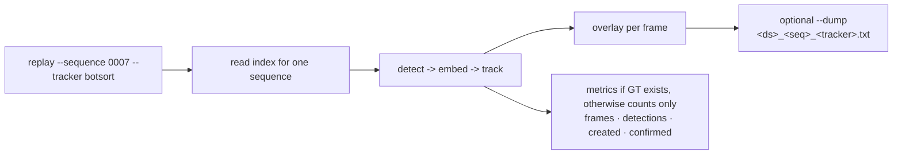

Watch the same clip with `bytetrack` and with `botsort` and the break is obvious.
That is the point: scores tell you a number is low, replay tells you why.

---

## 6. The threshold ladder

The single most load-bearing idea in the project. Precision is bought **after**
tracking, using persistence and kinematics and cross-camera agreement, not by
discarding evidence early.

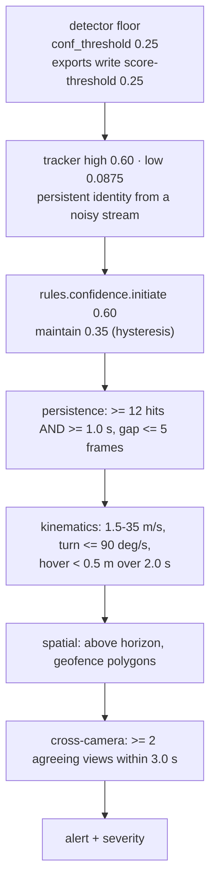

The detector is permissive, the rule layer is strict, and **each layer is
measured against its own ground**:

| layer | threshold | why that value |
| --- | --- | --- |
| detector | 0.25 | recall. The low-confidence detections that carry the motion evidence are the ones worth keeping |
| nvinfer (reference render) | 0.175 | `maintain / 2`. Explicitly not 0.60 — see the comment in `deploy/pipeline.py:285` |
| tracker high | 0.60 | mirrors `confidence.initiate` |
| tracker low | 0.0875 | `maintain / 4`, so the second pass can still see a genuinely hard frame |
| rule initiate | 0.60 | precision. Where an alert is actually raised |

Raising the detector to 0.60 starves the tracker of exactly the frames it needs.

### 6.1 The five rule gates

Conjunctive, ordered cheap-and-geometric-first so a bird is rejected before
anything expensive runs. Tri-state, and this is the important part:

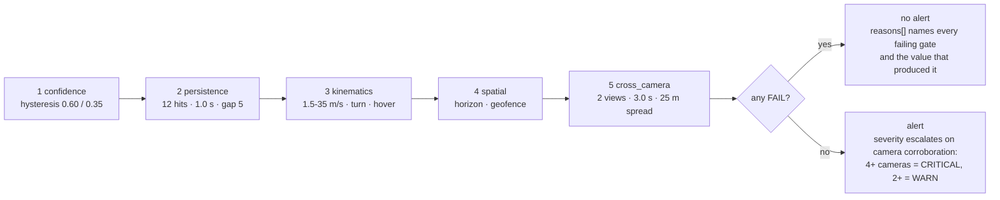

Only `FAIL` blocks. A gate whose input is unavailable returns **`SKIPPED`** with
a reason naming the setting to configure — never `passing`. A missing input is
never mistaken for a satisfied rule.

The consequence is worth stating plainly: **an uncalibrated site runs three of
the five gates** (confidence, persistence, cross-camera) and reports spatial and
kinematics as skipped. That is deliberate — blocking all alerts during bring-up
would mean a silent site. One exception, and it is deliberate in the other
direction: **a local track with no global identity is a FAIL, not a skip.** One
view cannot distinguish a drone from a bird well enough to alert, and treating it
as skipped would let any lone per-camera detection raise a drone alert.

`POST /api/rules/explain` (and `anti-uav rules explain --track`) returns every
gate's verdict plus the measured value behind it, so you can ask "why was this
not alerted?" against the live rule set.

---

## 7. Export and hand-off

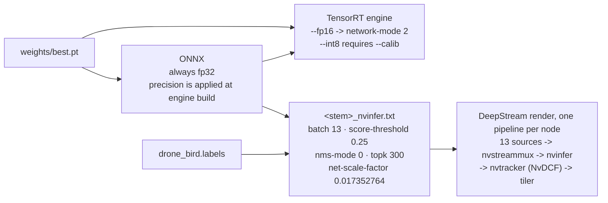

`artifacts/exports/<run>/` holds the ONNX, the engine, `export_report.json`, the
generated `nvinfer` config and `drone_bird.labels`. `engine_only` is rejected on
purpose: TensorRT engines are built on the deployment host, so export ONNX here
and build there — the error message prints the exact `trtexec` command.

The **measured** trackers and the **deployed** tracker are deliberately not
claimed to be equivalent. `sort`/`bytetrack`/`botsort` are what
`track-eval` scores; NvDCF is what would run on a Jetson. The NvDCF config
mirrors the Python thresholds deliberately — `max-missing-frames: 4` matches
`tracking.max_target_age_frames`, `min-height: 15` matches
`min_trackable_height_px`, `num-targets: 100` matches `max_detections` — and its
header names the required ablation rather than pretending one number covers both.

`nvinfer`'s `interval` is **1** — every frame is inferred. Frame-skipping is
available (`render(..., interval=n)`) but is not the default: a 12 px drone moves
several pixels per frame at 30 fps, so sampling at 7.5 Hz turns its trajectory
into a staircase and costs the tracker exactly the low-confidence frames ByteTrack
exists to rescue. Frame-skipping is the lever for a node that cannot hold the
batch, not a free 4×.

---

## 8. Artifact lineage

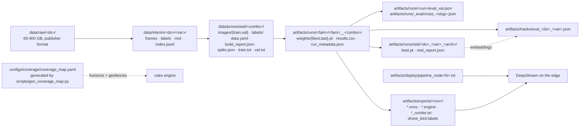

`run_metadata.json` is the reproducibility record: run name, model, combo,
profile, epochs requested and completed, imgsz, batch, amp, duration, best
metrics, the resolved `primary_metric` and its value, both checkpoint paths, the
**full resolved recipe and profile override**, the full environment, and every
warning raised. Copy the run directory; do not regenerate it.

---

## 9. Running the whole thing

```mermaid
flowchart LR
    A["verify-env<br/>HARD GATE"] --> B["fetch-weights"]
    B --> C["download"]
    C --> D["convert"]
    D --> E["stats<br/>always runs"]
    E --> F["splits"]
    F --> G["build"]
    G --> H["sanity<br/>HARD GATE"]
    H --> I["train / matrix run"]
    I --> J["evaluate --cross"]
    J --> K["track-eval --dataset mmuav"]
    K --> L["export"]
    L --> M["deploy render"]
```

```powershell
.\scripts\run_pipeline.ps1 -DryRun      # print all 13 stages, touch nothing
.\scripts\run_pipeline.ps1 -Profile pascal
```

Each stage skips itself when its output already exists, so the script is safe to
re-run after an interruption. `verify-env` and `sanity` are hard gates: a
non-zero exit from either stops the run rather than wasting GPU hours on a box
with the wrong torch build or a leaked split.

`fetch-weights` also exits non-zero regardless of `-StopOnFailure`, because every
later stage needs it.

---

## 10. What this audit changed

Drawing this diagram turned up thirteen places where the code and the documented
intent disagreed. All thirteen are now fixed, and every one that could change a
number carries a test. The list is kept because each entry is a class of bug worth
recognising in the next feature.

### 10.1 Silent no-ops — a config that says one thing and the code does another

1. **ByteTrack's low-confidence second pass never ran.** `update` discarded the
   low split and handed `_second_pass` the *high* list, which then re-split it —
   and splitting a list that is already entirely above `high_threshold` yields
   an empty result, so the pass returned immediately. `bytetrack` was silently
   single-pass and `botsort` inherited the same dead path. The low list is now
   passed through instead of re-derived.
   *Test:* `TestLowConfidenceSecondPass`.
2. **`cutout` and `ir_grayscale_probability` never reached the trainer.** Both
   were in the YAML with explanatory comments, and `matrix.yaml` justifies raising
   `ir_grayscale_probability` so the backbone cannot key on palette as a modality
   shortcut — but ultralytics has no such knobs and neither string appeared in
   `trainer.py`, so the defence the combo notes rely on was not active. Both are
   now applied by a project-owned callback (`detection/augment.py`) rather than
   deleted, because the intent behind them is real.
   *Test:* `tests/test_augment.py`.
3. **`extra.nms` and `warmup_momentum` / `warmup_bias_lr` were parsed and
   ignored.** `nms` is now forwarded explicitly (YOLO true, RT-DETR false);
   the warmup pair is forwarded too. `extra.label_smoothing` was removed rather
   than forwarded: ultralytics has no such key and both recipes set it to `0.0`,
   so it was documenting an off switch that did not exist.
4. **`batch_scale` was inert.** It scaled nothing because `resolve_batch` never
   read it, and `pascal.yaml` set it to `0.08` beside a `force_batch: 8` that
   did the real work. It now scales a recipe-pinned batch, and warns instead of
   pretending when the recipe is on auto-fit (`-1`), which cannot be scaled from
   outside because ultralytics reads the card itself.
5. **`metric:` claimed to control early stopping and could not.** Ultralytics
   always early-stops on its internal `fitness` blend and exposes no hook.
   `patience` is what bounds a run. `metric:` now does the thing it can honestly
   do: it names the headline, resolved against the `results.csv` column and
   written to `run_metadata.json` as `primary_metric`.
6. **`deploy render`'s `interval` was ignored.** The parameter defaulted to 4 and
   the docstring promised ~7.5 Hz inference, while the emitted config hard-coded
   `interval=1`. Now the parameter is honoured, the default is 1, and the
   rationale for *not* frame-skipping is written down where it will be read.
7. **The default `warmup_epochs` appeared twice.** Both at the recipe top level
   and under `optimizer:`, with only the `optimizer` one read. The duplicate
   schema field is gone.

### 10.2 Measurements that were wrong or untrustworthy

8. **`track-eval` re-ran detection once per tracker** — roughly 3× the inference
   cost it appeared to be, and any inter-run nondeterminism showed up as a
   tracker difference. Detection is now computed once per sequence into frozen
   `DetectedBox` rows, with a fresh `TrackObservation` built per tracker
   (`TrackObservation` is mutable and a track holds a reference to it).
   *Tests:* `TestReplayDetectionCache` asserts one inference pass *and* that
   cached scores match the uncached path exactly.
9. **`SequenceResult.track_length_avg` was declared and never populated** — and
   `anti-uav replay --json` was already printing it, so the field read a
   confident `0.0`. Now computed and exported.
10. **Anti-UAV's visibility flags never reached the metric.**
    `visibility_aware` scoring is switched on for exactly one dataset and reads
    the `vis` column of the MOT file — but Anti-UAV's converter never wrote one,
    so the loader fell back to YOLO labels, which have no visibility field and
    hardcode it to `1.0`. Every frame looked fully visible, which is the one thing
    that makes that dataset worth scoring. The converter now emits MOT rows via a
    base-class `mot_row_for` hook, so the `v <= 0` frames reach the metric.
11. **The ReID tier was unreachable.** `train_reid` writes to
    `artifacts/runs/reid/<dataset>_<variant>_<arch>/best.pt`, but the implicit
    lookup only ever checked `artifacts/runs/reid/best.pt` — a path no run
    produces. So the appearance gate ran on the colour descriptor unless a
    caller passed a checkpoint by hand. The lookup now takes the newest actual
    run, and `--reid <path>` exists on `track-eval` and `replay` to compare two.
12. **The trained-ReID default arch did not exist.** `load_reid` defaulted to
    `osnet_x0_25`, which is not in `ARCHITECTURES`, so any checkpoint without an
    explicit `arch` raised `ValueError` and fell through to the colour
    descriptor. The default is now a buildable architecture, and a bad declared
    arch is reported rather than replaced.

### 10.3 A feature that existed but was never connected

13. **`compensate_camera_motion` had no caller**, and pointed the wrong way: it
    transformed the *detections* forward, when a track's box is the thing
    expressed in the previous frame. Correcting only that is not enough — a 200 px
    pan is also measured as 200 px/frame of *target* velocity, which throws the
    prediction off on the following frame. So the measured box is projected
    first, the velocity is added on top, and the camera's own displacement is
    subtracted from the velocity measurement. All three trackers accept
    `global_motion=` on `update()`. One target crossing a 200 px pan is now one
    identity instead of two. *Test:* `TestCameraMotionCompensation`.

### 10.4 Smaller corrections

- `_anti_uav_frame`'s docstring claimed the average covered only frames where the
  target was present. The implementation includes absent frames, which is the
  better behaviour — it is what penalises hallucinating a box in empty sky — so
  the docstring now says that instead of the code being "corrected" toward a
  worse metric.
- `reid_train`'s success message recommended `anti-uav track-eval --reid <ckpt>`,
  a flag that did not exist. It does now.
- `artifacts/tracks/README.md` documented a 10-column MOTChallenge layout
  (`bb_width`, `bb_height`) while the writer emits 9 columns of xyxy. The project
  is internally consistent on xyxy — matching MM-UAV's own `gt.txt` and its own
  reader — so the README was wrong, and now says so explicitly, including how to
  convert for a MOT17-style loader.
- `load_default` was described as falling back *silently*. It does log a warning;
  the wording was corrected rather than the code.

### 10.5 What is still deliberately not true

- `nvdcf` is a recognised tracker name that raises, pointing at the DeepStream
  config. That is intended: the Python stack is what is *measured*, NvDCF is what
  would be *deployed*, and the NvDCF config header names the ablation needed
  before anyone claims they are equivalent.
- MM-UAV's MOTA is not comparable to published MOT17 numbers. Its trajectory
  annotation is strict. Read it as absolute.
- `cutout` and `ir_grayscale_probability` are applied to the batch tensor, not
  inside ultralytics' `RandomPerspective`. They run after mosaic and flip, so a
  cutout patch can span mosaic seams. That is a real difference from an
  in-pipeline cutout and is deliberate: it is the only route that works without
  the albumentations extra.
- `albumentations` is not installed and not depended on. If it is ever added, the
  two augmentations could move to `hyp.augmentations` and lose the seam artefact.
