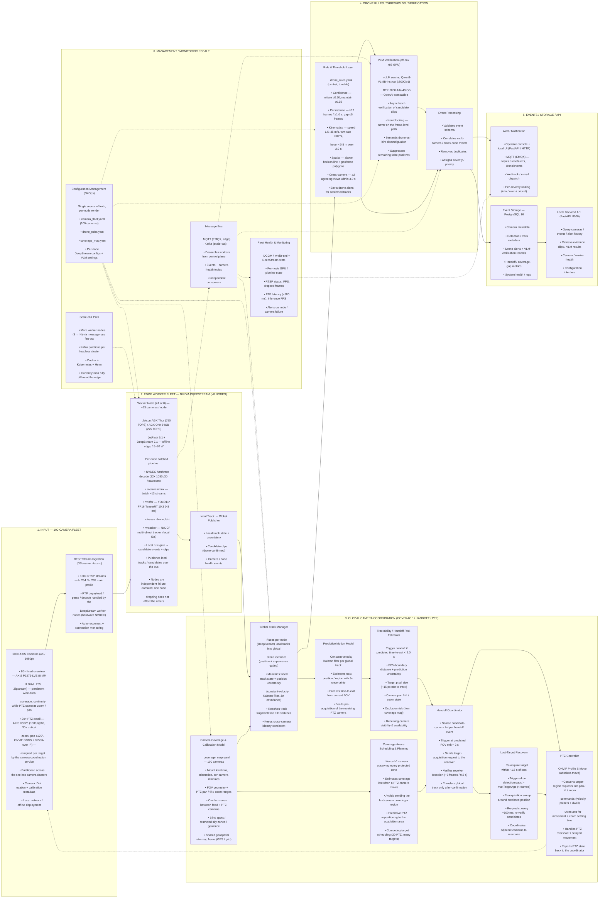

```mermaid
flowchart LR

    %% =========================================================
    %% 1. INPUT — 100-CAMERA FLEET
    %% =========================================================

    subgraph INPUT["1. INPUT — 100-CAMERA FLEET"]
        FLEET["100× AXIS Cameras (4K / 1080p)<br/><br/>
        • 80× fixed overview — AXIS P3275-LVE (8 MP,<br/>
          H.264/H.265 Zipstream) — persistent wide-area<br/>
          coverage, continuity while PTZ cameras zoom / pan<br/>
        • 20× PTZ detail — AXIS V5925 (1080p@60, 30× optical<br/>
          zoom, pan ±170°, ONVIF G/M/S + VISCA over IP) —<br/>
          assigned per target by the camera coordination service<br/>
        • Partitioned across the site into camera clusters<br/>
        • Camera ID + location + calibration metadata<br/>
        • Local network / offline deployment"]

        RTSP["RTSP Stream Ingestion (GStreamer rtspsrc)<br/><br/>
        • 100× RTSP streams — H.264 / H.265 main profile<br/>
        • RTP depayload / parse / decode handled by the<br/>
          DeepStream worker nodes (hardware NVDEC)<br/>
        • Auto-reconnect + connection monitoring"]
    end

    FLEET --> RTSP


    %% =========================================================
    %% 2. EDGE WORKER FLEET (HEADLESS DEEPSTREAM NODES)
    %% =========================================================

    subgraph WORKERS["2. EDGE WORKER FLEET — NVIDIA DEEPSTREAM (×8 NODES)"]
        WORKER["Worker Node (×1 of 8) — ~13 cameras / node<br/><br/>
        Jetson AGX Thor (750 TOPS) / AGX Orin 64GB (275 TOPS)<br/>
        JetPack 6.1 + DeepStream 7.1 — offline edge, 15–60 W<br/><br/>
        Per-node batched pipeline:<br/>
        • NVDEC hardware decode (22× 1080p30 headroom)<br/>
        • nvstreammux — batch ~13 streams<br/>
        • nvinfer — YOLO11n FP16 TensorRT 10.3 (~3 ms)<br/>
          classes: drone, bird<br/>
        • nvtracker — NvDCF multi-object tracker (local IDs)<br/>
        • Local rule gate → candidate events + clips<br/>
        • Publishes local tracks / candidates over the bus<br/><br/>
        • Nodes are independent failure domains; one node<br/>
          dropping does not affect the others"]

        QUEUE1["Local Track → Global Publisher<br/><br/>
        • Local track state + uncertainty<br/>
        • Candidate clips (drone-confirmed)<br/>
        • Camera / node health events"]
    end

    RTSP --> WORKER
    WORKER --> QUEUE1


    %% =========================================================
    %% 3. GLOBAL COORDINATION / TRACKING (HEADLESS)
    %% =========================================================

    subgraph COORD["3. GLOBAL CAMERA COORDINATION (COVERAGE / HANDOFF / PTZ)"]
        GTRACK["Global Track Manager<br/><br/>
        Fuses per-node (DeepStream) local tracks into global<br/>
        drone identities (position + appearance gating)<br/>
        • Maintains fused track state + position uncertainty<br/>
          (constant-velocity Kalman filter, 3σ covariance)<br/>
        • Resolves track fragmentation / ID switches<br/>
        • Keeps cross-camera identity consistent"]

        COVMAP["Camera Coverage & Calibration Model<br/><br/>
        coverage_map.yaml — 100 cameras<br/>
        • Mount locations, orientation, per-camera intrinsics<br/>
        • FOV geometry + PTZ pan / tilt / zoom ranges<br/>
        • Overlap zones between fixed + PTZ cameras<br/>
        • Blind spots / restricted sky zones / geofence<br/>
        • Shared geospatial site-map frame (GPS / grid)"]

        MOTION["Predictive Motion Model<br/><br/>
        Constant-velocity Kalman filter per global track<br/>
        • Estimates next position / region with 3σ uncertainty<br/>
        • Predicts time-to-exit from current FOV<br/>
        • Feeds pre-acquisition of the receiving PTZ camera"]

        RISK["Trackability / Handoff-Risk Estimator<br/><br/>
        Trigger handoff if predicted time-to-exit < 2.0 s<br/>
        • FOV-boundary distance + prediction uncertainty<br/>
        • Target pixel size (~15 px min to track)<br/>
        • Camera pan / tilt / zoom state<br/>
        • Occlusion risk (from coverage map)<br/>
        • Receiving-camera visibility & availability"]

        HANDOFF["Handoff Coordinator<br/><br/>
        • Scored candidate-camera list per handoff event<br/>
        • Trigger at predicted FOV exit − 2 s<br/>
        • Sends target-acquisition request to the receiver<br/>
        • Verifies receiver detection (~3 frames / 0.5 s)<br/>
        • Transfers global track only after confirmation"]

        COVPLAN["Coverage-Aware Scheduling & Planning<br/><br/>
        Keeps ≥1 camera observing every protected zone<br/>
        • Estimates coverage lost when a PTZ camera moves<br/>
        • Avoids sending the last camera covering a region<br/>
        • Predictive PTZ repositioning to the acquisition area<br/>
        • Competing-target scheduling (20 PTZ, many targets)"]

        PTZCTRL["PTZ Controller<br/><br/>
        ONVIF Profile S Move (absolute-move)<br/>
        • Converts target-region requests into pan / tilt / zoom<br/>
          commands (velocity presets + dwell)<br/>
        • Accounts for movement + zoom settling time<br/>
        • Handles PTZ overshoot / delayed movement<br/>
        • Reports PTZ state back to the coordinator"]

        RECOVERY["Lost-Target Recovery<br/><br/>
        Re-acquire target within ~1.5 s of loss<br/>
        • Triggered on detection gaps > maxTargetAge (4 frames)<br/>
        • Reacquisition sweep around predicted position<br/>
        • Re-predict every ~100 ms; re-verify candidates<br/>
        • Coordinates adjacent cameras to reacquire"]
    end

    QUEUE1 --> GTRACK
    COVMAP --> GTRACK
    GTRACK --> MOTION
    MOTION --> RISK
    RISK --> HANDOFF
    COVMAP --> COVPLAN
    COVPLAN --> HANDOFF
    HANDOFF --> PTZCTRL
    PTZCTRL -.-> FLEET
    HANDOFF --> RECOVERY
    RECOVERY --> PTZCTRL


    %% =========================================================
    %% 4. VERIFICATION / RULES / EVENTS
    %% =========================================================

    subgraph RULES["4. DRONE RULES / THRESHOLDS / VERIFICATION"]
        RULEINFER["Rule & Threshold Layer<br/><br/>
        drone_rules.yaml (central, tunable)<br/>
        • Confidence — initiate ≥0.60, maintain ≥0.35<br/>
        • Persistence — ≥12 frames / ≥1.0 s, gap ≤5 frames<br/>
        • Kinematics — speed 1.5–35 m/s, turn rate ≤90°/s,<br/>
          hover <0.5 m over 2.0 s<br/>
        • Spatial — above horizon line + geofence polygons<br/>
        • Cross-camera — ≥2 agreeing views within 3.0 s<br/>
        • Emits drone alerts for confirmed tracks"]

        VLMSRV["VLM Verification (off-box x86 GPU)<br/><br/>
        vLLM serving Qwen3-VL-8B-Instruct (:8000/v1)<br/>
        RTX 6000 Ada 48 GB — OpenAI-compatible<br/>
        • Async batch verification of candidate clips<br/>
        • Non-blocking — never on the frame-level path<br/>
        • Semantic drone-vs-bird disambiguation<br/>
        • Suppresses remaining false positives"]

        EVENTPROC["Event Processing<br/><br/>
        • Validates event schema<br/>
        • Correlates multi-camera / cross-node events<br/>
        • Removes duplicates<br/>
        • Assigns severity / priority"]
    end

    GTRACK --> RULEINFER
    RULEINFER --> VLMSRV
    VLMSRV --> EVENTPROC
    RULEINFER --> EVENTPROC


    %% =========================================================
    %% 5. EVENTS / STORAGE / API
    %% =========================================================

    subgraph EVENTS["5. EVENTS / STORAGE / API"]
        ALERT["Alert / Notification<br/><br/>
        • Operator console + local UI (FastAPI / HTTP)<br/>
        • MQTT (EMQX) — topics drone/alerts, drone/events<br/>
        • Webhook / e-mail dispatch<br/>
        • Per-severity routing (info / warn / critical)"]

        STORE["Event Storage — PostgreSQL 16<br/><br/>
        • Camera metadata<br/>
        • Detection / track metadata<br/>
        • Drone alerts + VLM-verification records<br/>
        • Handoff / coverage-gap metrics<br/>
        • System health / logs"]

        API["Local Backend API (FastAPI :8000)<br/><br/>
        • Query cameras / events / alert history<br/>
        • Retrieve evidence clips / VLM results<br/>
        • Camera / worker health<br/>
        • Configuration interface"]
    end

    EVENTPROC --> ALERT
    EVENTPROC --> STORE
    STORE --> API


    %% =========================================================
    %% 6. MANAGEMENT / MONITORING / SCALE
    %% =========================================================

    subgraph MGMT["6. MANAGEMENT / MONITORING / SCALE"]
        HEALTH["Fleet Health & Monitoring<br/><br/>
        DCGM / nvidia-smi + DeepStream stats<br/>
        • Per-node GPU / pipeline state<br/>
        • RTSP status, FPS, dropped frames<br/>
        • E2E latency (<500 ms), inference FPS<br/>
        • Alerts on node / camera failure"]

        CONFIG["Configuration Management (GitOps)<br/><br/>
        Single source of truth, per-node render<br/>
        • camera_fleet.yaml (100 cameras)<br/>
        • drone_rules.yaml<br/>
        • coverage_map.yaml<br/>
        • Per-node DeepStream configs + VLM settings"]

        SCALE["Scale-Out Path<br/><br/>
        • More worker nodes (8 → N) via message-bus fan-out<br/>
        • Kafka partitions per headless cluster<br/>
        • Docker + Kubernetes + Helm<br/>
        • Currently runs fully offline at the edge"]

        BUS["Message Bus<br/><br/>
        MQTT (EMQX, edge) → Kafka (scale-out)<br/>
        • Decouples workers from control plane<br/>
        • Events + camera health topics<br/>
        • Independent consumers"]
    end

    WORKER -.-> BUS
    BUS -.-> GTRACK
    BUS -.-> VLMSRV
    BUS -.-> EVENTPROC
    BUS -.-> HEALTH

    CONFIG -.-> WORKER
    CONFIG -.-> GTRACK
    CONFIG -.-> COVMAP
    CONFIG -.-> RULEINFER
    CONFIG -.-> VLMSRV
    SCALE -.-> WORKER
    HEALTH -.-> ALERT
```
